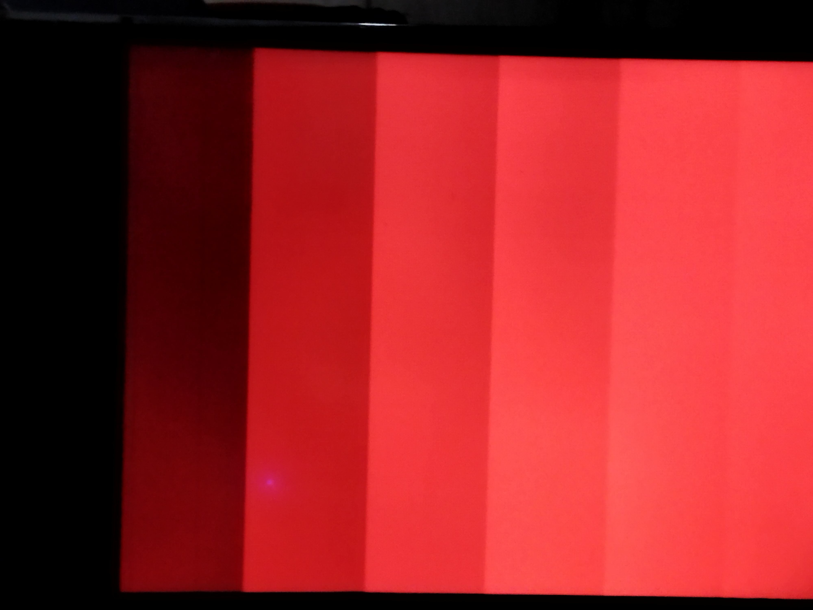
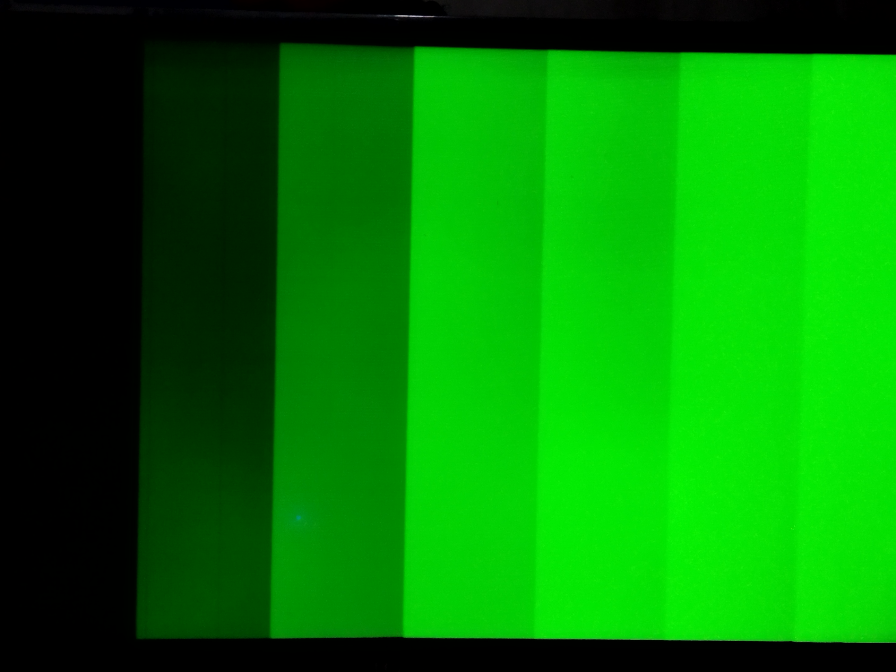
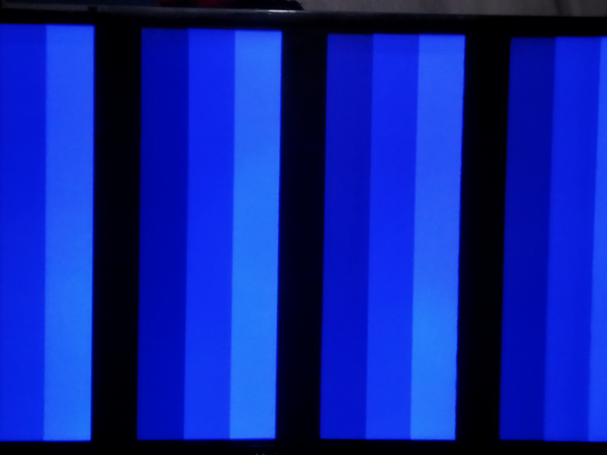
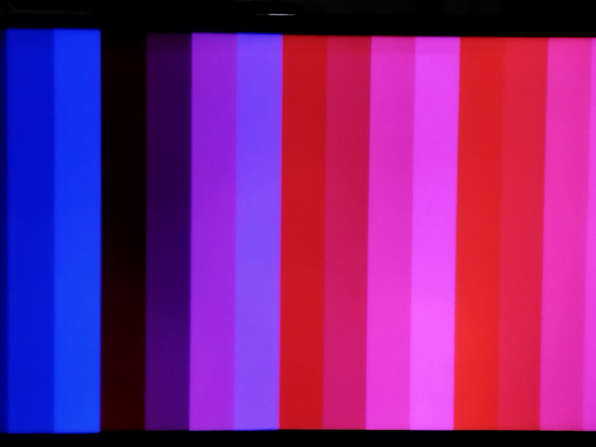
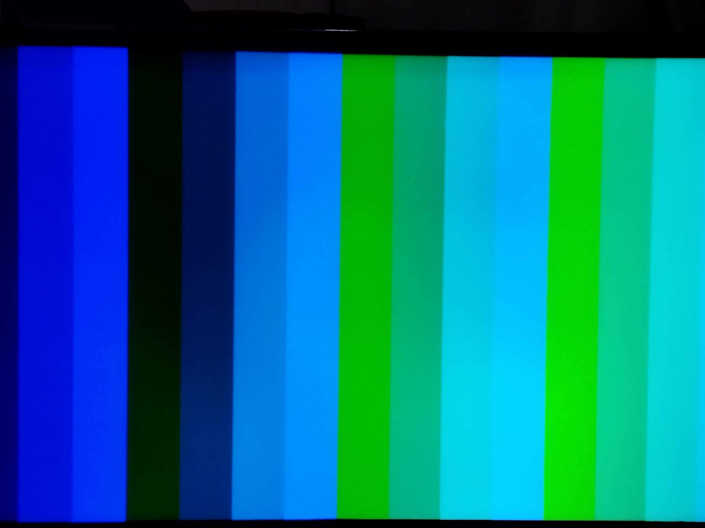
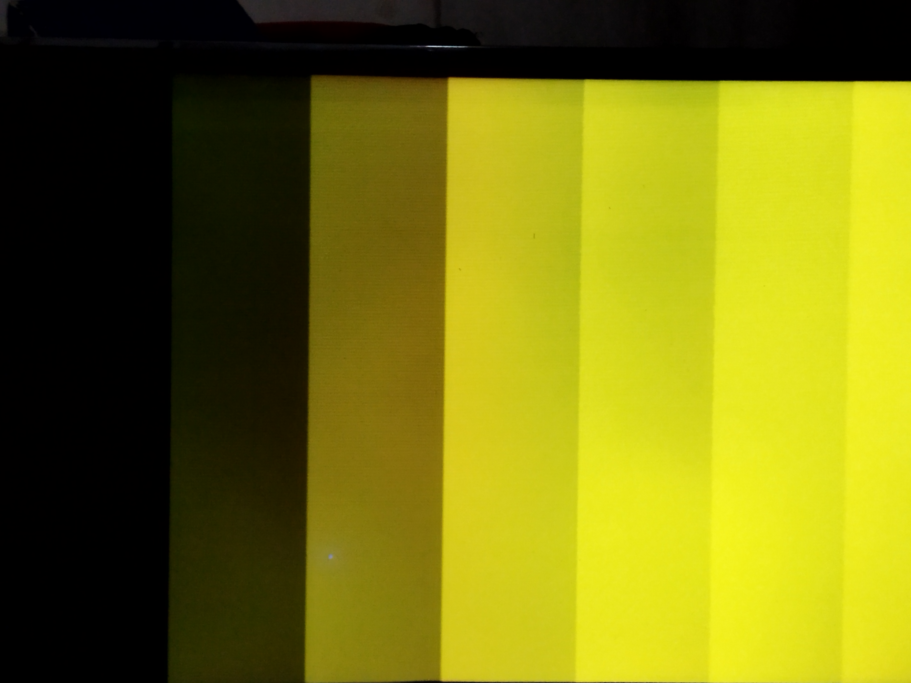
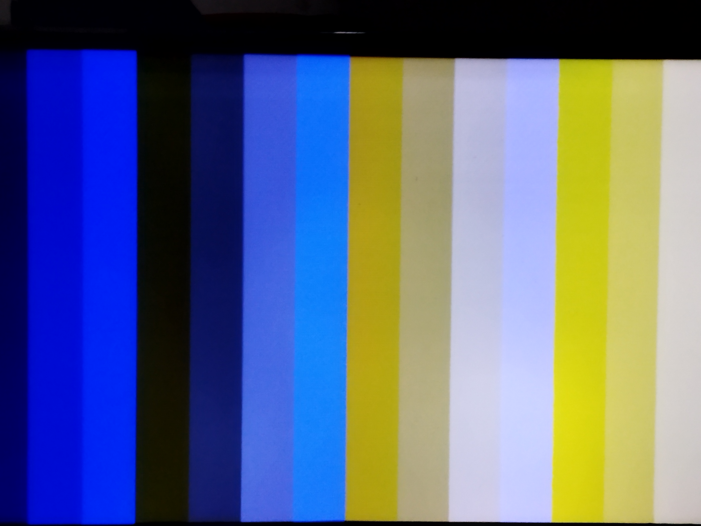
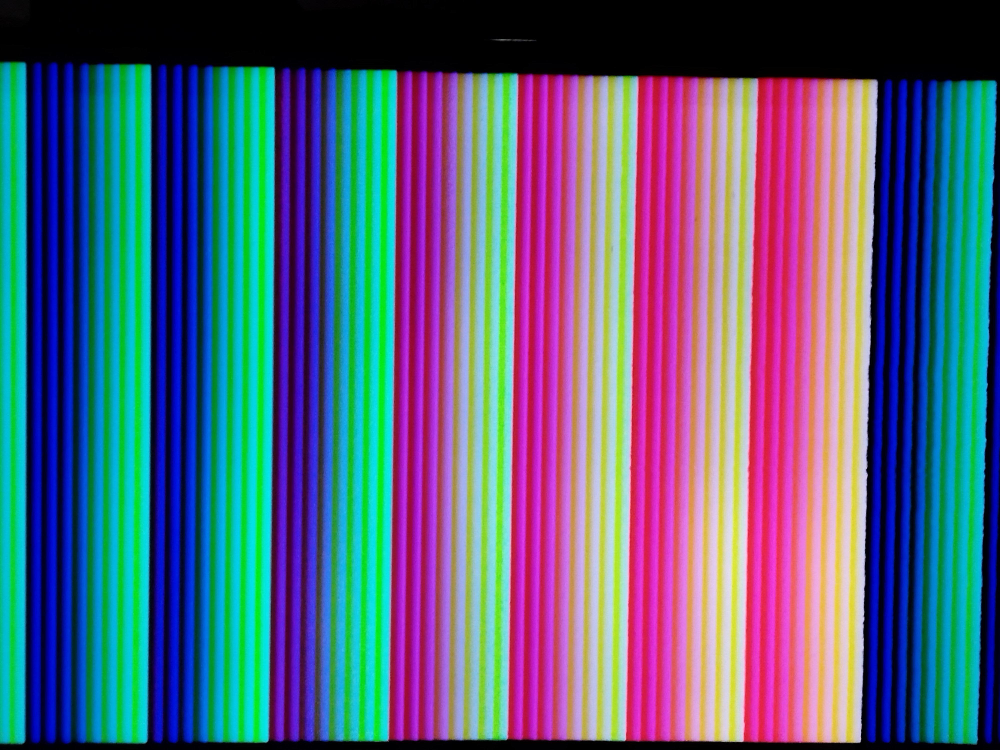
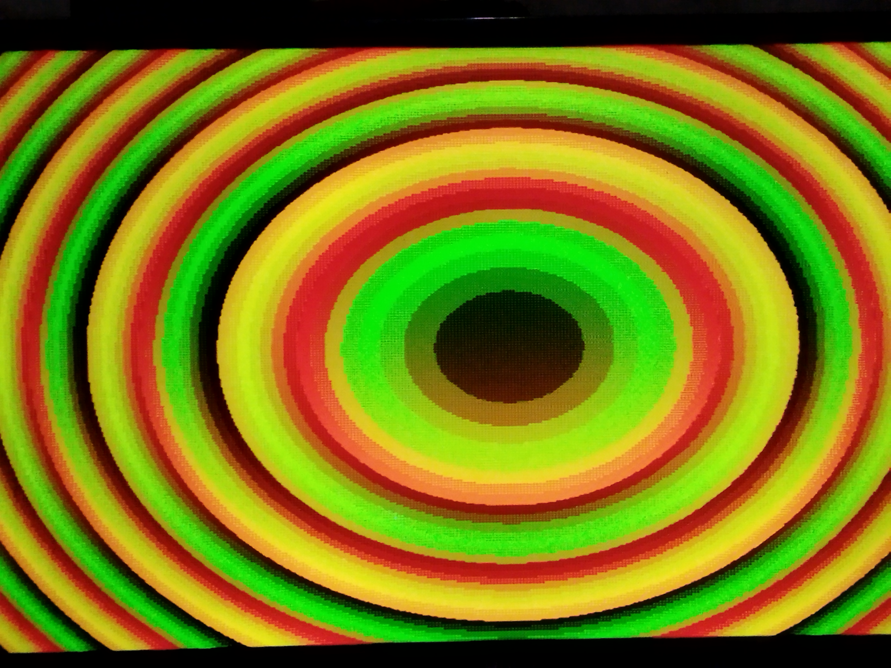

# LeonVGA

Generador de señal de video VGA de 8 bits (RGB 332).

## Implementación
Se utilizó la placa icefun con el ice40HX8K para la generación del reloj de la seal de sincronismo y los patrones. Las salidas, indicadas en el archivo pcf,  `vga_red[2:0]`,  `vga_green[2:0]`, `vga_blue[1:0]`, `vga_hsync` y `vga_vsync` provienen de un latch interno en el bloque IO del FPGA y pasan a través de una red de resistencias para entregar el valor analógico respectivo al puerto VGA. 

## Patrones de señal
Aprovechando el paralelismo del FPGA, se implementaron 10 patrones de 16 posibles espacios, en los cuales se observan los colores principales y sus combinaciones. Las señales pasan a través de una red de sincronismo pues ocurre un CDC (clock-Domain Crossing).

| patrones | patrones | patrones
|---------------------------------|-----------------------------------|---|
|  |  |  |
|  |  |  |
|  |  |  |
 

| abc | def |
| --- | --- |
| bar |
| bar | baz | boo |

## Referencias
BrunoLevy, [FOMU_VGA](https://github.com/BrunoLevy/learn-fpga/tree/master/Basic/FOMU/FOMU_VGA): Utilice el modo en que trabaja con SB_IO en verilog para que todas las señales sean estables. Así mismo, partí de este mismo principo del Latch para generar otro que sirva como intermedio para la generacion de los patrones. Esto también sirve para la memoria BRAM que entrega el dato en un pixel especifico en el siguiente ciclo. Así, leon_vga resultó en un pipelining.
Splinedrive, [vga_ctrl](https://github.com/splinedrive/kianRiscV/blob/master/archive/harris_baremetal_stuff/kianv_harris_mcycle_edition/gateware/vga_ctrl.v): El codigo del módulo `sync_vga` en `leon_vga.v` está totalmente basado en este circuito. La gran diferencia es que los parametros fueron separados pues el modulo principal `VGA` llama a `sync_vga`.
